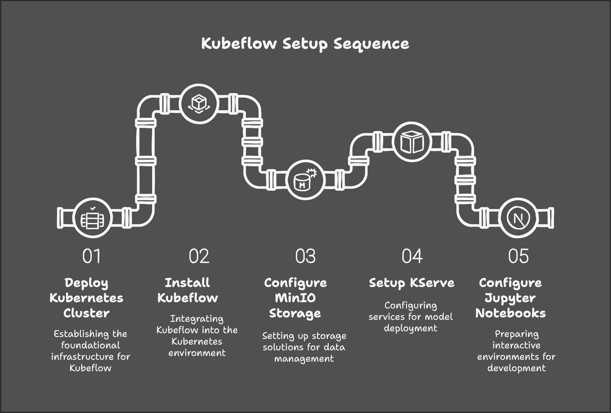
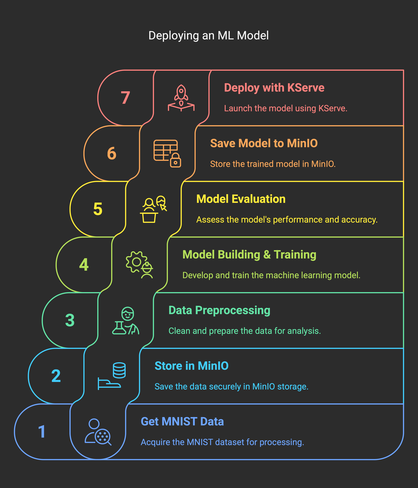
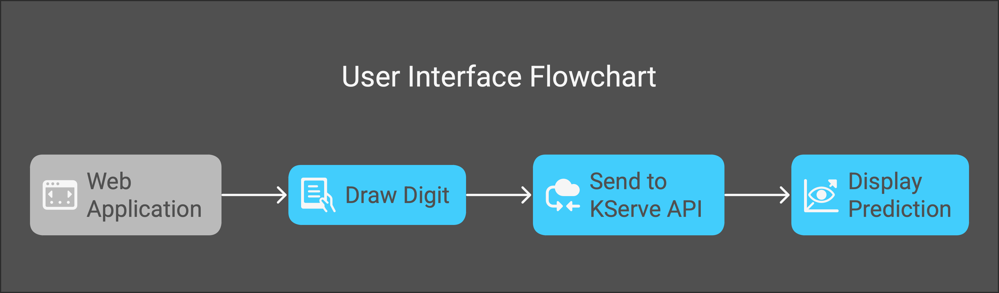

# Digits Recognizer with Kubeflow

## Project Overview
This repository contains a complete MLOps workflow for the MNIST digit recognition task using Kubeflow. The project demonstrates how to build, train, and deploy a machine learning model that can recognize handwritten digits using a complete Kubeflow pipeline.


## Workflow Diagrams

### Kubeflow Setup Sequence
The following diagram illustrates the setup sequence for Kubeflow:



### ML Model Deployment Steps
This diagram shows the step-by-step process for deploying a machine learning model:




## Workflow Architecture

The workflow consists of the following components:

1. **Data Collection & Preparation**
   - Dataset: MNIST handwritten digits
   - Data preprocessing and normalization
   - Data storage in MinIO object storage

2. **Model Development**
   - CNN model built with TensorFlow/Keras
   - Training and evaluation with metrics tracking
   - Model serialization and storage

3. **Model Serving**
   - KServe inference service deployment
   - REST API endpoint for predictions
   - Web application for interactive testing

4. **MLOps Pipeline**
   - End-to-end Kubeflow pipeline implementation
   - Reproducible workflow with versioning
   - Component containerization and orchestration

## Repository Structure

```
digits-recognizer-kubeflow/
├── LICENSE.md                         # License information
├── USECASE.md                         # Use case documentation
├── digits_recognizer_notebook.ipynb   # Model exploration notebook
├── digits_recognizer_pipeline.ipynb   # Kubeflow pipeline definition
├── images/                            # Documentation images
├── kfp_examples/                      # Kubeflow Pipeline examples
│   ├── kfpv1_examples.ipynb           # KFP v1 examples
│   └── kfpv2_examples.ipynb           # KFP v2 examples
├── kserve_python_test.ipynb           # KServe testing notebook
├── kubeflow_configs/                  # Kubeflow configuration files
│   ├── access_kfp_from_jupyter_notebook.yaml
│   ├── create_kserve_inference.yaml
│   ├── proxy-fix-notebooks.yaml
│   └── set-minio-kserve-secret.yaml
├── tf_saved_model/                    # Saved TensorFlow model
└── web_app/                           # Web interface for digit recognition
    ├── index.html
    ├── js_code.js
    ├── stylesheet.css
    └── tf.min.js
```

## Prerequisites

- Kubernetes Cluster 1.21+
- Kubeflow 1.5.1+ installed
- MinIO for object storage
- KServe for model serving

## Getting Started

### 1. Deploy Kubernetes and Kubeflow

Install Kubeflow on your Kubernetes cluster by following the [official documentation](https://www.kubeflow.org/docs/started/installing-kubeflow/).

Verify all components are running:
```bash
kubectl get pods --all-namespaces
```

### 2. Access Kubeflow Dashboard

Forward the Kubeflow dashboard port:
```bash
kubectl port-forward svc/istio-ingressgateway -n istio-system 8080:80
```

Access the dashboard at [http://localhost:8080](http://localhost:8080)

### 3. Configure Jupyter Notebooks

Enable access to Kubeflow Pipelines from Jupyter notebooks:
```bash
kubectl apply -f kubeflow_configs/access_kfp_from_jupyter_notebook.yaml
```

Create a new notebook server:
- Select `jupyter-tensorflow-full:v1.5.0` image
- Enable pipeline access in configuration

### 4. Configure MinIO Storage

Get MinIO credentials:
```bash
kubectl get secret mlpipeline-minio-artifact -n kubeflow -o jsonpath="{.data.accesskey}" | base64 --decode
kubectl get secret mlpipeline-minio-artifact -n kubeflow -o jsonpath="{.data.secretkey}" | base64 --decode
```

Access MinIO dashboard:
```bash
kubectl port-forward -n kubeflow svc/minio-service 9000:9000
```

### 5. Configure KServe

Set up MinIO secrets for KServe:
```bash
kubectl apply -f kubeflow_configs/set-minio-kserve-secret.yaml
```

### 6. Run the ML Pipeline

1. Open the Jupyter notebook from the Kubeflow dashboard
2. Clone this repository to your workspace
3. Open `digits_recognizer_pipeline.ipynb`
4. Execute all cells to create and run the pipeline

The pipeline will:
- Load the MNIST dataset
- Preprocess the data
- Train a CNN model
- Save the model to MinIO
- Deploy the model with KServe

### User Interface Flowchart
This flowchart illustrates how the user interacts with the application:



### 7. Test the Model

You can test the deployed model using:
- The `kserve_python_test.ipynb` notebook
- The web application in the `web_app/` directory

## Web Application Usage

1. Configure the web app to connect to your KServe endpoint
2. Open `web_app/index.html` in a browser
3. Draw a digit on the canvas
4. Click "Predict" to get the model's prediction

## Pipeline Components

The ML pipeline consists of the following components:

1. **Data Loading**: Loads MNIST data and stores it in MinIO
2. **Data Reshaping**: Formats and normalizes the image data
3. **Model Building**: Defines, trains, and evaluates the CNN model
4. **Model Serving**: Deploys the model using KServe

## Troubleshooting

If KServe can't fetch Docker images, add the following to your configuration:
```bash
kubectl -n knative-serving edit configmap config-deployment
```

Add the entry:
```yaml
registriesSkippingTagResolving: "index.docker.io"
```

For more troubleshooting information, see the [KServe documentation](https://kserve.github.io/website/developer/debug/).

## Contributing

Contributions are welcome! Please feel free to submit a Pull Request.

## License

This project is licensed under the Apache License 2.0 - see the [LICENSE.md](LICENSE.md) file for details.

## Acknowledgments

- MNIST dataset from Yann LeCun
- Kubeflow project
- TensorFlow and Keras
- KServe project